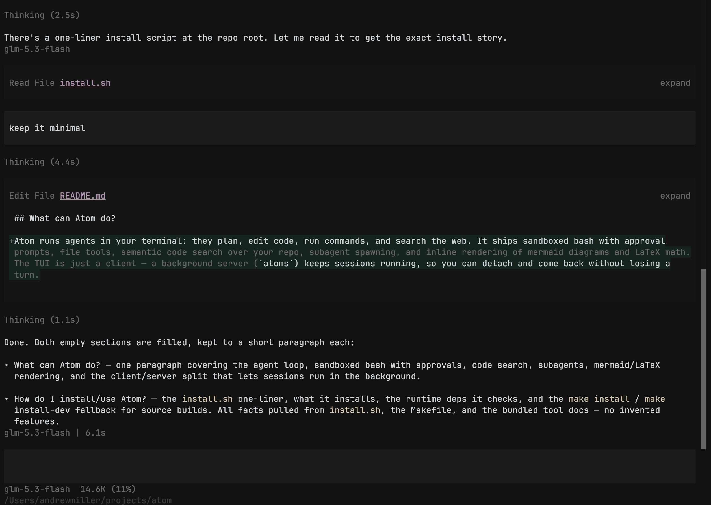

# Atom (Experimental)



Atom is a small yet powerful experimental agent harness, allowing you to manage agents effectively with minimal resources.

You can use it with your OpenAI, Opencode Go, Ollama Cloud subscriptions, with over 100+ providers sourced from models.dev. Certain subscriptions like Anthropic / Cursor are not supported at this time.

## Why make a harness?

Most harnesses that I've tried personally use too much memory/cpu, look ugly, or don't have enough features. I've made Atom to be resource efficient, capable, while looking polished at the same time. Harnesses can substantially improve model performance, so a personal harness tuned to my preferences was worthwhile working on.

## What can Atom do?

Atom runs agents in your terminal: they plan, edit code, run commands, and search the web. It ships sandboxed bash with approval prompts, file tools, semantic code search over your repo, subagent spawning, and inline rendering of mermaid diagrams and LaTeX math. The TUI is just a client — a background server (`atoms`) keeps sessions running, so you can detach and come back without losing a turn.

## How do I install/use Atom?

**Homebrew** (macOS, arm64):

```sh
brew install andrewmillercode/tap/atom
```

**Install script** (macOS, x86_64 + arm64):

```sh
curl -fsSL https://raw.githubusercontent.com/andrewmillercode/atom/main/install.sh | bash
```

That installs `atom` (the TUI) and `atoms` (the session server) into `~/.local/bin`, adds them to your PATH, and checks the runtime deps (`rg`, `uv`, `merman-cli`). Then just run `atom` in a repo — it starts the server for you. To build from source instead, use `make install` (or `make dev` for a separate `atomdev`/`atomsdev` setup).

## Contributions

This harness is mostly a personal project, but contributions are welcome. You are free to fork / clone / modify atom to your liking and taste, or provide feature requests/suggestions via Issues.
